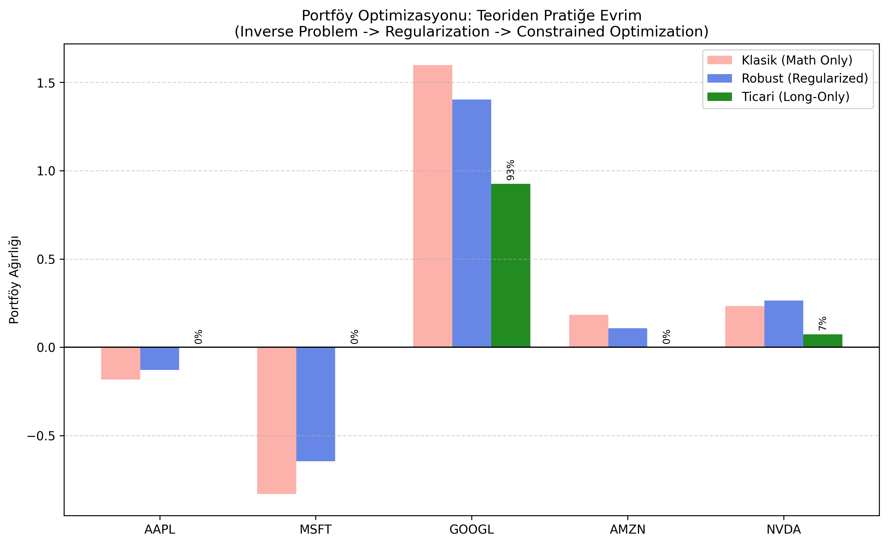

# Robust-Portfolio-Optimization
Overview

This project explores the mathematical instability of financial portfolio optimization and applies Inverse Design principles to solve it. Using historical data from major tech stocks (AAPL, MSFT, GOOGL, AMZN, NVDA), it demonstrates how classical methods fail under noise and how Regularization (Tikhonov/Ledoit-Wolf) and Constrained Optimization provide robust, tradeable solutions.
🔬 The Problem: Ill-Posedness in Finance

In Markowitz Portfolio Theory, finding optimal weights requires inverting the Covariance Matrix (Σ−1). However, financial data is highly correlated, leading to a high Condition Number. This makes the problem "Ill-Posed," where small noise in data leads to extreme, unusable portfolio weights (e.g., -800% leverage).
🛠️ Methodology

I implemented three levels of mathematical sophistication to solve this:

   1. Naive Solution (Inverse Problem): Direct inversion of the sample covariance matrix.

        Result: Extreme instability, massive leverage, and unrealistic short positions.

   2. Robust Solution (Regularization): Application of Ledoit-Wolf Shrinkage (a form of Tikhonov Regularization) to condition the matrix.

        Result: Reduced variance and dampened extreme weights, providing a mathematically stable solution.

   3. Commercial Solution (Constrained Optimization): Moving from Linear Algebra to Convex Optimization (using scipy.optimize) to enforce "Long-Only" (wi​≥0) and budget constraints (∑wi​=1).

        Result: A realistic, deployable portfolio allocation.

📊 Key Results
### 📊 Key Results

The comparison below demonstrates the evolution of the portfolio weights across three mathematical approaches:

#### 1. Scenario Visualization

#### 2. Weight Allocation Table
The table highlights how constraints transform the solution from mathematically chaotic to financially feasible.

| Strategy | AAPL | MSFT | GOOGL | AMZN | NVDA | Outcome |
| :--- | :---: | :---: | :---: | :---: | :---: | :--- |
| **Naive** (Classical) | -18.4% | -83.1% | 159.8% | 18.4% | 23.3% | ❌ **High Leverage & Shorting** (Unstable Inverse Problem) |
| **Robust** (Regularized) | -12.9% | -64.6% | 140.3% | 10.8% | 26.5% | ⚠️ **Reduced Variance** (Dampened Extremes) |
| **Real-World** (Constrained) | **0.0%** | **0.0%** | **92.6%** | **0.0%** | **7.4%** | ✅ **Long-Only Portfolio** (Feasible Solution) |

> **Mathematical Insight:** The Naive solution fails due to the high condition number of the covariance matrix. The Constrained solution (Green) yields a **"Corner Solution"**, allocating capital only to the assets with the highest marginal Sharpe Ratio contribution (GOOGL & NVDA), automatically zeroing out others.

💻 Technologies Used

  Python: Core logic.

  NumPy & SciPy: Linear Algebra and Convex Optimization solvers (SLSQP).

  Scikit-Learn: Ledoit-Wolf Covariance estimation.

  YFinance: Real-time market data ingestion.
